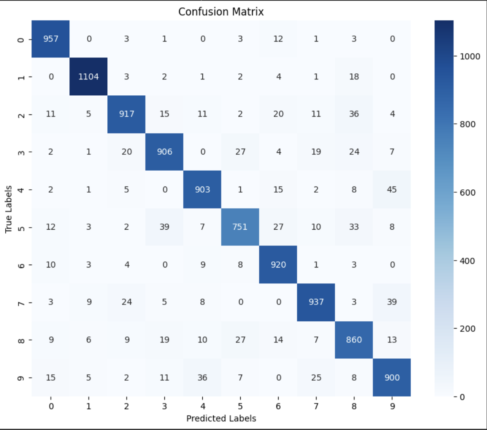
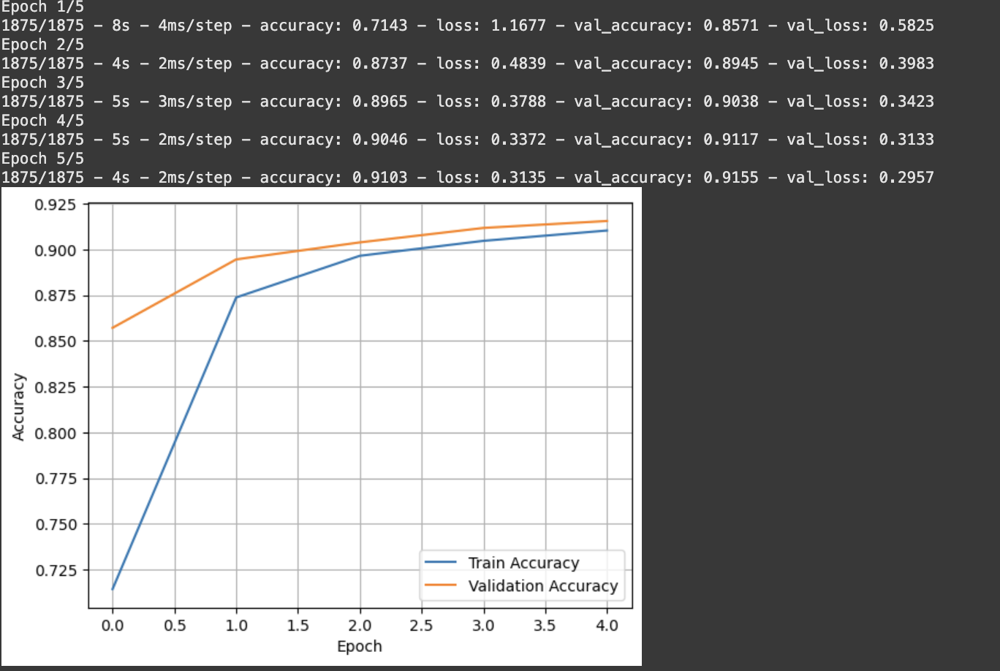

# MNIST Handwritten Digit Classification Project

This project demonstrates the implementation of a simple neural network (MLP) to classify handwritten digits from the MNIST dataset. It covers data preparation, model creation, training, evaluation, and saving.

## Project Overview

We used the MNIST dataset, which consists of 60,000 training images and 10,000 testing images of handwritten digits (0-9). The images were preprocessed, normalized, and fed into a neural network with one hidden layer of 128 neurons.

## Model Architecture

- Input Layer: 784 neurons (flattened 28x28 image)
- Hidden Layer: Dense layer with 128 neurons, ReLU activation
- Output Layer: Dense layer with 10 neurons (one for each digit), softmax activation

The model was trained for 5 epochs.

## Final Performance

- Final test accuracy: **~91.5%**

## Visualizations

Here’s a look at the final confusion matrix and the training/validation accuracy curves:

### Final Confusion Matrix


### Accuracy Curves


## Installation

Clone the repository and install dependencies:
```bash
git clone <your-repo-url>
cd <your-repo-folder>
pip install -r requirements.txt
